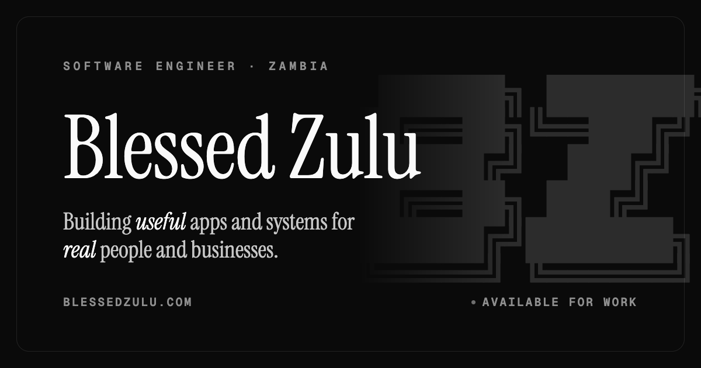

# blessedzulu.com

A minimal personal / portfolio site, built to be forked. Static output, no database,
no server to maintain. One config file holds everything that makes it *yours*; the
templates never hardcode identity or content.

Built with [Jigsaw](https://jigsaw.tighten.co) (Blade + flat-file markdown), Tailwind v4,
and Vite. The one flourish is an interactive ASCII fluid on the home page that spells **BZ**.



## Quickstart

Requirements: PHP 8.2+, Composer, and Node 18+.

```bash
composer install
npm install
npm run dev        # Vite dev server (hot-reloads CSS/JS while editing)
```

Build the static site:

```bash
npm run build                          # Vite build (CSS/JS assets)
./vendor/bin/jigsaw build production   # renders HTML into build_production/
```

Preview the built site with any static server:

```bash
cd build_production && python3 -m http.server 8000
```

Deploy the contents of `build_production/` to any static host (Cloudflare Pages,
Netlify, a plain box, etc.).

Netlify is configured in [`netlify.toml`](netlify.toml). Two gotchas worth knowing
if you deploy this elsewhere: it is a **PHP** site, so your host must run
`composer install` (npm alone is not enough - `vendor/` is gitignored and the
Jigsaw binary lives there), and `composer.json` pins `config.platform.php` to
**8.3** because that is the newest PHP on Netlify's build image. Raise that pin if
your host offers a newer PHP.

## Make it yours

Almost everything lives in **[`config.php`](config.php)**, split into commented blocks:

| Block            | What it controls                                                        |
| ---------------- | ----------------------------------------------------------------------- |
| `site`           | Name, tagline, description, locale                                      |
| `person`         | Job title, location, timezone, email, `knowsAbout` (schema topics)      |
| `socials`        | Social links - drives the footer, contact page and schema `sameAs`      |
| `stack`          | The tools shown as chips on the About page                              |
| `nav`            | The header menu (add/remove a line)                                     |
| `routes`         | The indexable pages listed in `sitemap.xml`                             |
| `projectGroups`  | The sections on the `/work` page, in order                             |
| `projects`       | The single source of truth for **both** the home shortlist and `/work`  |

Add a project to `projects` once and it appears on the home shortlist (if
`'featured' => true`) and on `/work`, with consistent naming in both places.

The live domain (for absolute canonical / Open Graph / sitemap URLs) is set in
**[`config.production.php`](config.production.php)**.

Design tokens - colours and the three typefaces - live in the `@theme` block of
**[`source/_assets/css/main.css`](source/_assets/css/main.css)**. Dark mode is a class
flip; everything reads `--color-*` tokens, so recolouring is a one-place change.

### The share image

`source/og.png` (1200x630) is rendered once from
`source/_assets/og-template.html`. Edit the template, then regenerate it with headless
Chrome:

```bash
chrome --headless=new --window-size=1200,630 --virtual-time-budget=5000 \
  --screenshot=source/og.png source/_assets/og-template.html
```

## How the pieces fit

- **Config-driven.** Jigsaw merges `config.php` into every page, so any view can read
  `$page->site`, `$page->projects`, and so on. Templates hold layout, not data.
- **Small partials** in `source/_partials/` keep the markup DRY:
  - `page-header` - the shared eyebrow + title + intro used by every page.
  - `work-row` / `work-row-compact` - the full `/work` row and the home shortlist row.
  - `status-pill` - the Live / In progress pill.
  - `head-seo` - meta, Open Graph, Twitter and JSON-LD, all from config.
- **SEO / discovery** is generated, not hand-maintained: `sitemap.xml`, `robots.txt`
  and `llms.txt` are Blade files driven by config, and `head-seo` emits a
  Person + WebSite + per-page schema graph.

## Project structure

```
config.php                       your identity, socials, nav, routes, projects
config.production.php            production baseUrl
source/
  _layouts/main.blade.php        shared layout: header, footer, <head>
  _layouts/post.blade.php        layout for a writing post
  _partials/                     page-header, work-row(-compact), status-pill, head-seo
  index.blade.php                home (hero + ASCII fluid + selected work)
  work.blade.php                 full project index (from config)
  about.blade.php                about + how I work + stack
  contact.blade.php              contact channels
  writing.blade.php              writing index
  _posts/*.md                    writing posts (markdown + front matter)
  sitemap.blade.php              -> /sitemap.xml
  robots.blade.php               -> /robots.txt
  llms.blade.php                 -> /llms.txt
  _assets/css/main.css           Tailwind v4 + design tokens (@theme)
  _assets/js/main.js             theme toggle, reveal, clock, header state
  _assets/og-template.html       source for the og.png share image
  js/fluid.js                    the BZ ASCII fluid (see below)
  og.png                         social share image
  favicon.svg
```

## The BZ fluid

`source/js/fluid.js` is a FLIP fluid simulation. The physics is Matthias Müller's
(Ten Minute Physics, MIT), by way of Javier Bórquez's ASCII version
([`javierbyte/fluid-triangle`](https://github.com/javierbyte/fluid-triangle), MIT).
The changes here are the render characters (they spell **BZ**), a calmer palette, and a
gate that pauses the simulation when it scrolls off-screen or the tab is hidden. The
original licence stays in the file header. It only runs on the home page.

Tuning lives in two places: colour and cell size in `main.css` (`.render`,
`--cell-size`), and the letters in `fluid.js` (`RENDER_CHARS`).

## Add a writing post

Create `source/_posts/my-slug.md`:

```markdown
---
extends: _layouts.post
section: content
title: My title
date: 2026-08-01
description: One line for the index and search.
---

Markdown body.
```

It builds to `/writing/my-slug`. Writing is not linked from the nav by default - add
`['label' => 'Writing', 'url' => '/writing']` to `nav` in `config.php` to surface it.

## Conventions

- UK English throughout.
- No em dashes.
- Three typefaces, each with one job: serif for display, sans for body, mono for
  all-caps labels and chips only.

## Credits

- ASCII fluid: [javierbyte/fluid-triangle](https://github.com/javierbyte/fluid-triangle) (MIT).
- Typefaces: Instrument Serif, Instrument Sans, Geist Mono (Google Fonts).

## Licence

[MIT](LICENSE). Fork it, make it yours.
